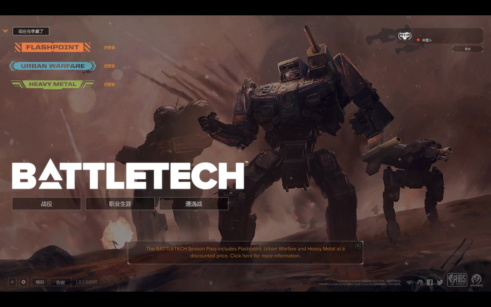
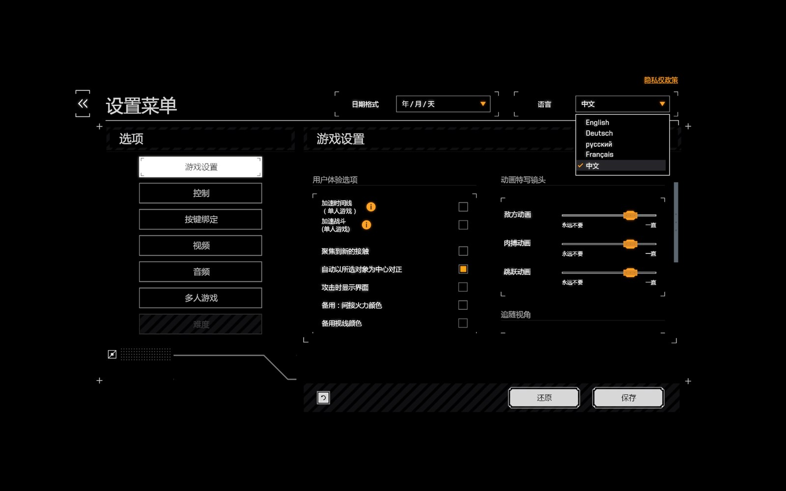
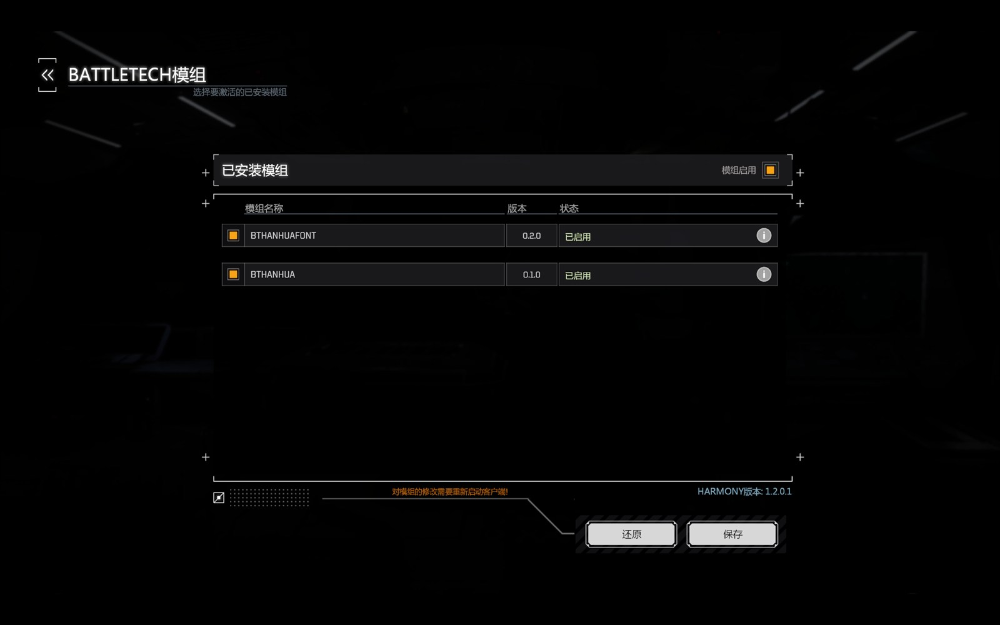
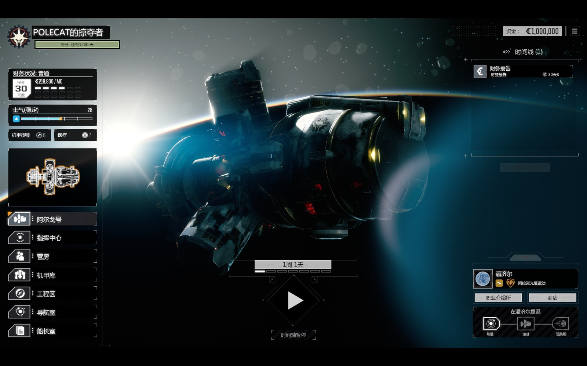
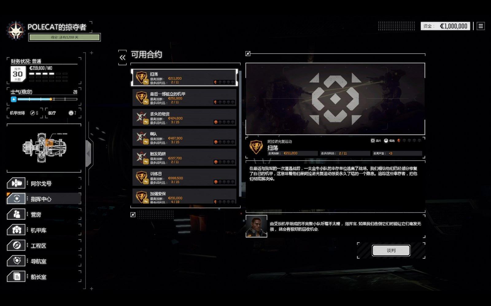
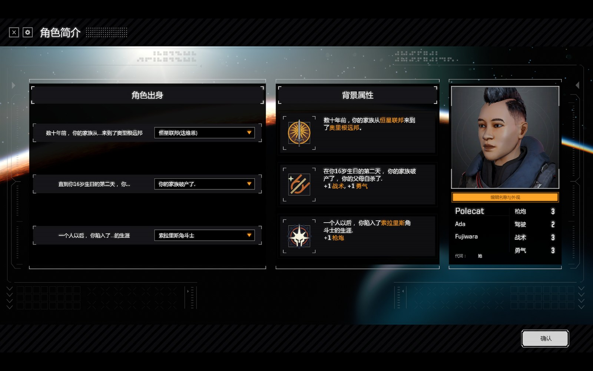
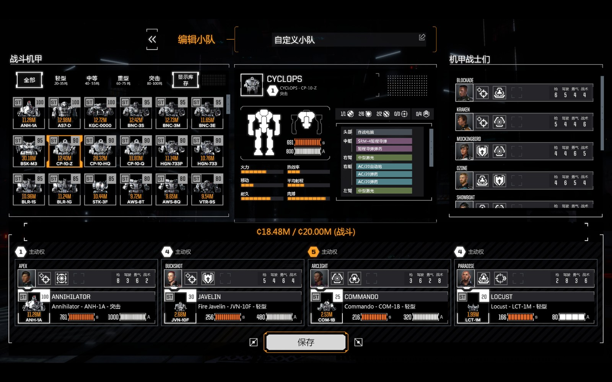
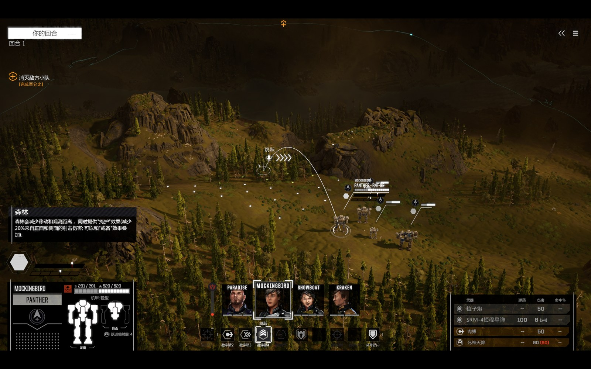

# BATTLETECH 简体中文汉化 (BTHanHua)

[](https://github.com/VelvetCthulhuRiot/BATTLETECH-zh-CN/releases/latest) [](LICENSE) 

给 **BATTLETECH (2018, Harebrained Schemes)** 做的简体中文汉化，通过游戏**官方 ModLoader** 注入，
**不修改游戏安装目录里的任何文件**。

- 覆盖 **21,505 / 21,505** 条官方本地化键（100%，0 条未翻译）
- 引用键顺序与官方 `strings_de-DE.csv` 完全一致
- 自带全量不变量自检脚本，可自行复核

> 游戏版本要求：**1.9.1 (build 686R)**，Steam AppID `637090`。
> `BTHanHuaFont.dll` 是针对该版本的游戏程序集编译的，换版本需要重新编译。

---

## 界面预览

| | |
|---|---|
| <br>主菜单 | <br>设置 → 语言 → **中文** |
| <br>MODS 里两个模组**已启用** | <br>生涯模式主界面（阿尔戈号） |
| <br>可用合约列表 | <br>角色出身与背景属性 |
| <br>遭遇战机甲库 / 自定义小队 | <br>遭遇战战斗界面 |

> 主菜单右下角的 **Season Pass 横幅仍是英文** —— 那串文字不经过游戏的本地化系统
> （它由外部注入，`LocalizeKey` 根本看不到），CSV 汉化覆盖不到，属于已知限制。
> 除此之外截图里的界面文字都是中文。

---

## 安装

1. 到 **[Releases](https://github.com/VelvetCthulhuRiot/BATTLETECH-zh-CN/releases/latest)** 下载 **`BTHanHua-mod.zip`**
   （仓库根目录也放了一份内容完全相同的 `BTHanHua-mod.zip`，或者直接克隆本仓库）
2. 把 `mods` 里的**两个文件夹**整体复制到：

   ```
   C:\Users\<你的用户名>\Documents\My Games\BattleTech\mods\
   ```

   （`mods` 目录不存在就自己新建。注意 `My Games` 里有空格）
3. 启动游戏 → 主菜单左下角 **MODS** → 勾选右上角 **「模组启用」** → 点 **SAVE**

   

4. **重启游戏** → **设置 → LANGUAGE → 中文**

   

第 3、4 步不能省：模组启用开关和语言选择存在**游戏自己的设置**里，不在 mod 文件夹内，
所以换电脑时要重新做一次。

### 卸载

删掉这两个文件夹即可：

```
mods\BTHanHua\
mods\BTHanHuaFont\
```

游戏安装目录零改动，**Steam「验证游戏文件完整性」不受影响**
（它只校验 depot 清单内的文件，不会删除未知文件，也不会因为我们而判定文件损坏）。

---

## 目录结构

```
mods\BTHanHua\          文本汉化 (Game Mod)
  mod.json              ModLoader 描述文件: Manifest 把 strings_zh-CN.csv 注入版本清单
  mod.alt.json          备用描述文件 (若 mod.json 加载失败, 用它替换再试)
  strings_zh-CN.csv     中文文本包 (21,505 条, 4.6 MB)
 说明.txt               随包说明

mods\BTHanHuaFont\      字体注入 (System Mod)
  systemMod.json        System Mod 描述文件
  BTHanHuaFont.dll      注入程序 (C#, 针对 1.9.1 编译)
  font                  UnityFS 字体包 (MSYH SDF, 2,615 字形) —— 让中文能渲染出来

src\                    注入程序源码
tools\                  构建与自检脚本
docs\screenshots\       界面截图
BTHanHua-mod.zip        打包好的便携版 (两个 mod 文件夹 + 迁移说明)
```

### 两个 mod 为什么要分开

游戏 ModLoader 要求 **Game Mod** 与 **System Mod** 用不同的 `Name`。
最初放在同一个文件夹里会导致 `ModLoader.GetCombinedModStatus()` 无限递归、MODS 菜单卡死，
所以拆成两个文件夹（`BTHanHua` / `BTHanHuaFont`）。

---

## 汉化是怎么生效的

游戏原生的多语言系统支持 10 种 culture，其中包括 `CULTURE_ZH_CN`（"Mandarin"），
但官方只发布了 de-DE / fr-FR / ru-RU。它的实现方式是：

1. 游戏支持的 culture 列表 = **版本清单（VersionManifest）里能找到的 CSV 资源**
2. `mod.json` 的 `Manifest` 声明一个 `CSV` 资源，ModLoader 就会把它注入版本清单
3. 于是「中文」出现在语言下拉框里，游戏按 `KEY,value` 逐条取值

所以**一行游戏文件都不用改**：我们只是往版本清单里加了一个资源。

### 几个必须遵守的格式约定（改文本时请注意）

| 约定 | 原因 |
|---|---|
| 值里**不能有半角逗号 `,`** | 会破坏游戏 CSV 解析。断句用全角 `，`；数字千位分隔也用全角（`160，000`） |
| 每行的双引号个数必须是**偶数** | 游戏解析器是引号状态机。一个字面引号要写成 `""`（官方 de/fr/ru 的引号连续段最长就是 2） |
| `[[引用键<U+001F>显示文本]]` | `[[...]]` 是富文本链接。**分隔符是一个不可见的 U+001F**，不是空格 |
| U+001F 也是官方的**逗号替身** | 官方 de-DE 在链接标记之外用了 29,409 个 U+001F。游戏载入时会还原成真逗号 |
| 只能用字形图集内的字 | 图集固定 2,610 个汉字（`tools/glyph-covered.txt`）。表外汉字在游戏里显示为**方块** |
| 不能出现字面 `\r` | 官方用 `\n`（3425 行）对 `\r\n`（仅 4 行） |

最后两条组合起来有个重要后果：`.NET` 数字格式串里的逗号**必须**写成 U+001F，
写成全角 `，` 会被 .NET 当成普通字符，于是机甲造价显示成 `2160000，，.00M` 而不是 `2.16M`。
这是本项目踩过的坑之一。

---

## 自检

仓库自带全量不变量自检，一条命令：

```powershell
node tools\verify-csv.mjs
```

退出码 0 = 全部通过。它检查：

```
[1] 编码形态      条目数 21505 · 无 BOM · 仅 LF
[2] 逐行解析      值内无半角逗号 · 每行引号数为偶数 · 引号连续段 ≤ 2
                  每个 [[...]] 恰好 1 个 U+001F 分隔符
                  全部字符都在字形图集内 · 无字面 \r
[3] 与官方对齐    官方 key 全部有译文 · 无多余 key · key 相对顺序与官方一致
[4] 链接标记      [[...]] 平衡 (相对官方无额外残缺)
```

脚本会自动从游戏目录读取官方 `strings_de-DE.csv` 做对照；找不到时只跳过对照项，不报错。
路径写在脚本顶部，换机器可自行修改。

---

## 出问题了怎么办

| 症状 | 处置 |
|---|---|
| 文字变成**方框**/不显示 | 删掉 `mods\BTHanHuaFont\` 文件夹。文本汉化不受影响，只是中文缺字形 |
| 界面还是**英文** | 设置 → LANGUAGE 选「中文」。若下拉框里没有「中文」，说明 `mod.json` 没加载成功——试试用 `mod.alt.json` 覆盖 `mod.json` |
| MODS 菜单**卡死** | 确认两个 mod 在**两个独立文件夹**里，且 `Name` 不同 |
| 想恢复原样 | 删掉两个文件夹，重启游戏 |

注入程序会往 `mods\BTHanHuaFont\BTHanHuaFont.log` 写自己的日志（游戏默认的
`settings.json` 里日志级别是 `Error` 且 `disableLoggingOnLoad: true`，所以不能只靠游戏日志）。
日志里可以看字形注入结果和漏译（MISS）记录。

---

## 已知限制（如实说明）

- **部分专名只能用拉丁原名**：字形图集固定 2,610 个汉字，缺 `鸦/鲸/虎/汤/曙/脸/睡` 等字，
  所以 Raven / Narwhal / Tigerfalcon / Long Tom / Fiji / Greece 这类保留了拉丁写法。
  这是「用社区字体包 + 白名单」这条技术路线的固有代价。
- **约 10,300 条社区人工译文（Paratranz）未做二次精修**：抽样看是 `glacier→冰川` 这种已译好的
  词条，改动收益接近零。机器翻译来源的部分（约 5,600 条）已逐条精修过。
- **2 处裸 `DM.*` 引用**保留原样：官方德语本身就是裸的，与官方保持一致。
- 少量开发者内部串（`(HIDDEN)…` 调试目标名）故意不翻译。
- **只支持 1.9.1 (686R)**：DLL 依赖该版本的游戏程序集。

---

## 从源码构建

`src\` 里是注入程序源码（`FontMod.cs` / `FullFont.cs`）。
用 .NET Framework 自带的编译器即可，**不需要装 Visual Studio**：

```powershell
$Game = "D:\Steam\steamapps\common\BATTLETECH"
$Managed = "$Game\BattleTech_Data\Managed"
$csc = "C:\Windows\Microsoft.NET\Framework64\v4.0.30319\csc.exe"

& $csc /target:library /nowarn:0618 /out:BTHanHuaFont.dll `
  /reference:"$Managed\UnityEngine.dll" `
  /reference:"$Managed\UnityEngine.CoreModule.dll" `
  /reference:"$Managed\UnityEngine.AssetBundleModule.dll" `
  /reference:"$Managed\UnityEngine.UI.dll" `
  /reference:"$Managed\UnityEngine.TextRenderingModule.dll" `
  /reference:"$Managed\Unity.TextMeshPro.dll" `
  /reference:"$Managed\Assembly-CSharp.dll" `
  /reference:"$Game\Mods\HBS\0Harmony.dll" `
  src\FontMod.cs src\FullFont.cs
```

> 注意：编译需要引用游戏自带的 `Assembly-CSharp.dll`，但**本仓库不包含它**
> （那是游戏本体代码，不随本仓库分发）。请自备正版游戏。

数据管线的完整工具链（合并各来源、术语统一、专名汉化、字形安全网等）也在 `tools\` 里，
其中 `merge-final.mjs` 需要自行准备上游语料后才能运行（见脚本内的路径常量）。

---

## 发布新版本

发版不用手动传文件，打个 tag 就行：

```powershell
cd repo
node tools\verify-csv.mjs                 # 先自检, 退出码 0 才继续
powershell -File tools\pack-mod.ps1       # 重新生成 dist\BTHanHua-mod.zip
copy dist\BTHanHua-mod.zip .              # 同步仓库根目录那份
git add -A; git commit -m "v1.1: ..."; git push
git tag -a v1.1 -m "v1.1"; git push origin v1.1
```

推 tag 会触发 [`.github/workflows/attach-release-asset.yml`](.github/workflows/attach-release-asset.yml)，
在 GitHub 的 runner 上自动创建 Release 并把 `BTHanHua-mod.zip` 挂上去。

> 为什么用 Actions 而不是本地 `gh release upload`：本机 `uploads.github.com` 被 DNS 污染
> （解析到 bit.ly 的 IP），直传走不通。放到 runner 上执行就绕开了。
>
> 也可以手动补挂：Actions → **Attach release asset** → Run workflow，填 tag 和文件名。

---

## 授权与致谢

- 本项目（注入程序源码、构建脚本、以及在此之上的译文修订）：**MIT**，见 [`LICENSE`](LICENSE)
- 译文语料改编自 **[cxwithyxy/BATTLETECH_zhcn](https://github.com/cxwithyxy/BATTLETECH_zhcn)**
  （MIT License, Copyright © 2022 cx2889），其中包含 Paratranz 社区人工译文
- 字体包 `font` 同样来自上述上游仓库（**MIT**），是 **Microsoft YaHei** 的 SDF 图集

第三方归属与字体的授权提示详见 [`THIRDPARTY.md`](THIRDPARTY.md)。

BATTLETECH 是 Harebrained Schemes / Paradox Interactive 的商标与版权作品。
本仓库只包含**文本与代码**，不含任何游戏本体文件；使用时请自备正版游戏。
